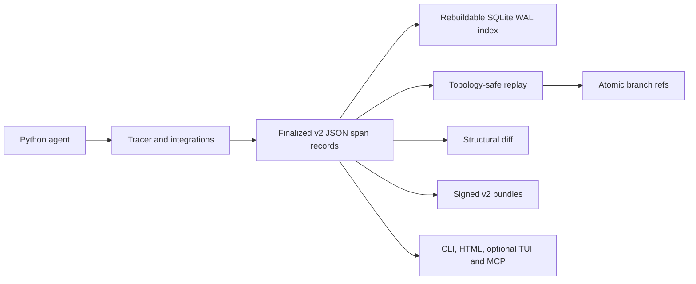

# Clew

[](https://github.com/samsamurai301/clew-ai/actions/workflows/ci.yml)
[](https://pypi.org/project/clew-ai/)
[](https://pypi.org/project/clew-ai/)
[](https://codecov.io/gh/samsamurai301/clew-ai)

**A zero-server, Git-like what-if debugger for Python agent traces.**

Clew records an agent run locally, lets you replay all or part of its topology with a
different executor, and structurally diffs the result. It needs no Clew account or
hosted collector, and it sends no analytics requests.

> [!IMPORTANT]
> Clew 1.1.5 uses store and bundle format v2. It deliberately refuses v1 data without
> changing or deleting it. Archive or rename an existing `.clew` directory, then run
> `clew init`. Version 1.1.4 was an unsafe launch artifact and should not be used.

## See the complete workflow

```bash
uvx clew-ai demo
```

That offline command creates a failing trace, replays it with a repaired executor,
creates a branch, prints a diff, and writes a self-contained HTML report. Both `clew`
and `clew-ai` command names are installed.


```text
failure trace  <trace-id>  ERROR
replay trace   <trace-id>  OK
branch         repaired
diff           modified spans
report         clew-demo-report.html
```

## Install

Core install (tracing, storage, replay, diff, signed bundles, CLI):

```bash
uv add clew-ai
# or
python -m pip install clew-ai
```

Optional surfaces stay out of the core dependency set:

```bash
uv add 'clew-ai[mcp]'
uv add 'clew-ai[tui]'
uv add 'clew-ai[langchain]'
uv add 'clew-ai[openai]'
uv add 'clew-ai[anthropic]'
```

Clew 1.1.5 supports Python 3.11 through 3.14.

## Workflow 1: trace a custom Python agent

```python
from pathlib import Path

from clew.sdk import SpanType, Tracer

tracer = Tracer(cwd=Path.cwd())

@tracer.agent
def answer(question: str) -> str:
    facts = search(question)
    return f"Answer from {len(facts)} local facts"

@tracer.span("search", type=SpanType.TOOL)
def search(question: str) -> list[str]:
    return [question, "local result"]

answer("What changed?")
```

```bash
clew log
clew show TRACE_ID
clew doctor
```

Every execution occurrence gets an independent UUID4 `id`; every execution trace gets
an independent UUID4 `trace_id`. A finalized `content_hash` covers every persisted field
except the hash itself. Identical inputs never collapse into one record.

## Workflow 2: replay, branch, and diff

Use the deterministic built-in executor to inspect topology without network calls:

```bash
clew replay TRACE_ID --executor mock
```

Or point at a Python callable and replay only a suffix:

```bash
clew replay TRACE_ID \
  --executor my_project.replay:execute \
  --from SPAN_ID \
  --branch prompt-fix
```

```python
from clew.sdk import ReplayContext, ReplayResult, Span

async def execute(span: Span, context: ReplayContext) -> ReplayResult:
    parent_outputs = [parent.output for parent in context.parent_chain]
    return ReplayResult(
        output={"parents": parent_outputs, "replayed": span.name},
        attributes={"candidate": "prompt-fix"},
    )
```

```bash
clew diff ORIGINAL_TRACE REPLAY_TRACE
clew show REPLAY_TRACE --html report.html
```

Replay allocates the full new topology before execution. Parent IDs always remain inside
the new trace. An executor exception records an `ERROR` occurrence, records dependent
descendants as `SKIPPED`, persists the diagnostic trace, prints its ID, and exits nonzero.

## Workflow 3: instrument a provider client

```python
from openai import OpenAI

from clew.sdk import Tracer
from clew.sdk.otel import instrument_openai

tracer = Tracer()
client = OpenAI()
instrument_openai(client, tracer=tracer)

client.chat.completions.create(
    model="gpt-4o-mini",
    messages=[{"role": "user", "content": "Explain this failure"}],
)
```

The OpenAI and Anthropic wrappers support sync and async clients, are idempotent for the
same tracer, retain nested parentage, redact credential-shaped arguments, and capture
outputs, errors, model names, and token usage. Reusing one wrapped client with a different
explicit tracer raises an error instead of silently sending data to the first store. See
[`examples/real_llm_agent.py`](examples/real_llm_agent.py).

## Architecture



The JSON records are authoritative; SQLite is a rebuildable query index. Writes use a
cross-process lock, unique temporary files, `fsync`, and atomic replacement. Reads verify
the record hash. Conflicting IDs, duplicate sequence values, missing parents, cycles,
malformed refs, and unsupported formats fail explicitly.

## Where Clew fits

Clew focuses on a small local workflow rather than replacing an observability platform:

- [LangGraph time travel](https://docs.langchain.com/oss/python/langgraph/use-time-travel)
  replays or forks checkpointed LangGraph state.
- [LangSmith trace comparison](https://docs.langchain.com/langsmith/manage-trace) compares
  traces managed through the LangSmith product.
- [Arize Phoenix](https://arize.com/docs/phoenix) provides an open-source observability,
  evaluation, and replay platform that can be self-hosted.
- [Langfuse](https://langfuse.com/self-hosting) provides a broader self-hosted LLM
  engineering platform.

Choose Clew when you want a Python package and local files for a reproducible
failure → replay → branch → diff loop. Its NDJSON bridge is **OTel-shaped JSON**, not an
OTLP exporter or a claim of protocol interoperability.

## Security and privacy

- No runtime telemetry or analytics network requests.
- Trace payloads are plaintext local files; protect `.clew` like source data.
- Ed25519 bundles provide integrity and signer-key authenticity, not encryption or
  real-world identity.
- MCP is optional and uses local stdio transport.
- Report vulnerabilities through
  [GitHub private vulnerability reporting](https://github.com/samsamurai301/clew-ai/security/advisories/new).

See [SECURITY.md](SECURITY.md), the [v1 compatibility notice](docs/migration.md), and the
[documentation site](https://samsamurai301.github.io/clew-ai/).

## Status

Clew 1.1.5 is classified as **Beta** while the corrected v2 contracts receive external
usage. Release artifacts are intended to be built and published by GitHub Actions with
PyPI trusted publishing; uploaded files are never replaced.

Contributions and reproducible bug reports are welcome under the [MIT License](LICENSE).
