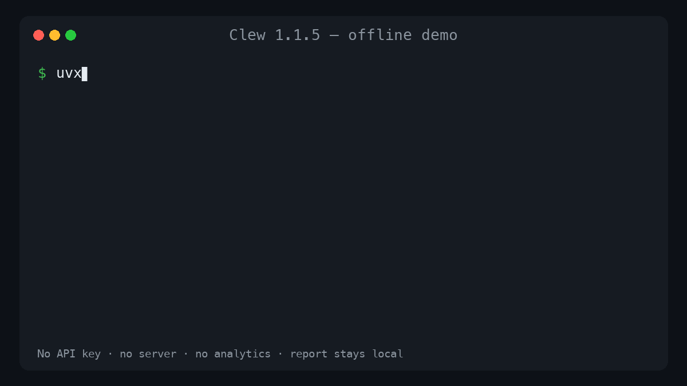

# Clew

**A zero-server, Git-like what-if debugger for Python agent traces.**

[Get started](getting-started/install.md){ .md-button .md-button--primary }
[View on GitHub](https://github.com/samsamurai301/clew-ai){ .md-button }

Clew records finalized Python agent spans to local v2 JSON records, maintains a
rebuildable SQLite query index, replays complete or partial trace topologies, and diffs
the result. There is no Clew service, account, collector, or runtime analytics request.

!!! warning "1.1.5 compatibility boundary"

    Store and bundle v2 are the only persisted formats accepted by 1.1.5. Clew refuses
    v1 data without modifying it. Archive or rename the old `.clew` directory and
    initialize a new store. Do not use 1.1.4.

## Try the offline walkthrough

```bash
uvx clew-ai demo
```



The demo records a failure, replays it with a repaired executor, creates a branch, prints
a structural diff, and writes a self-contained HTML report.

## What the corrected contract guarantees

- Every span occurrence has a unique UUID4 hexadecimal `id`.
- Every execution has an independent UUID4 hexadecimal `trace_id`.
- `sequence` establishes deterministic order within a trace.
- `content_hash` verifies every persisted field except itself.
- Only finalized `OK`, `ERROR`, or `SKIPPED` spans are persisted.
- Replay allocates all new IDs before execution and rewrites every parent reference.
- Provider integrations retain nested parentage for sync and async clients.
- Store writes are cross-process locked, atomic, and recoverable through index rebuilds.

## Small, optional surfaces

The default install contains the tracer, storage, replay, diff, CLI, HTML output, and
signed bundles. MCP, Textual, LangChain, OpenAI, Anthropic, and OpenTelemetry tooling live
in named extras so applications pay only for the integrations they use.

## Scope

Clew is a focused local debugging workflow. It does not claim OTLP interoperability or
replace hosted/self-hosted observability platforms. Its NDJSON format is an
**OTel-shaped JSON projection**. See the [FAQ](faq.md) for the distinction and the
[architecture](internals/architecture.md) for the exact storage and replay model.

## Security

Trace payloads are plaintext local data. Signed bundles authenticate a signer key and
protect integrity; they do not encrypt content or prove a real-world identity. Report
vulnerabilities through
[GitHub private vulnerability reporting](https://github.com/samsamurai301/clew-ai/security/advisories/new).
