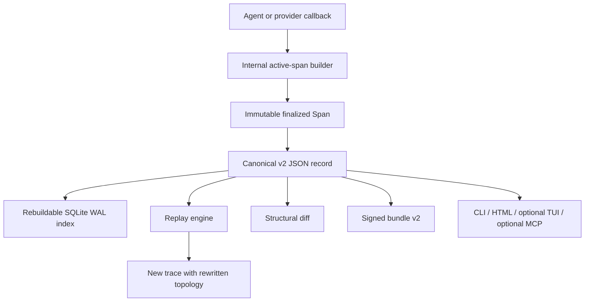

# Architecture

Clew is a local Python library and CLI. It does not require a Clew server.



## Store v2

```text
.clew/
├── manifest.json
├── .store.lock
├── HEAD
├── refs/
│   └── main
├── spans/
│   └── ab/
│       └── ab…32-hex-id….json
└── index.sqlite
```

`manifest.json` declares `{"format": "clew-store", "version": 2, ...}`. Canonical JSON
span records are authoritative. SQLite accelerates lookup and can be rebuilt from verified
records after deletion or corruption.

Writes acquire both an in-process lock and a cross-process file lock. A record is written
to a uniquely named exclusive temporary file, flushed, `fsync`ed, and atomically replaced.
The containing directory is also synchronized. SQLite runs in WAL mode with a busy timeout
and `FULL` synchronous behavior.

The reader verifies record shape and `content_hash`. The trace layer then checks exactly
one root, same-trace parents, unique sequence values, missing parents, and cycles.

## Tracing lifecycle

Decorators, context managers, and integrations create an internal mutable builder. It
holds the active ID, parent, sequence, start time, and payload updates. Success, exception,
cancellation, and generator completion finalize that builder into one immutable `Span`.
No partially running record is persisted.

Python `ContextVar` state preserves nesting across synchronous and asynchronous code.
LangChain callbacks use LangChain `run_id` and `parent_run_id` mappings so concurrent runs
do not depend on callback arrival order.

## Replay

The replay engine validates the source trace and determines the included topology. For a
partial replay it includes the selected span, descendants, and complete ancestor closure.
It allocates every destination ID first, then rewrites all parents into the new trace.

Ancestors are cloned as finalized records. Executed spans receive a `ReplayContext` whose
`parent_chain` contains finalized destination ancestors. Executors return only
`ReplayResult`; the engine controls identity, topology, timestamps, status, and hashing.

Failure records an `ERROR` span. Any descendant that depends on that failure becomes
`SKIPPED`. Independent topology can continue. The diagnostic trace is persisted.

## Diff

Diff alignment uses ancestry, span type/name, and sibling occurrence order. A repeated
sibling name cannot overwrite another occurrence. The comparison then reports added,
removed, modified, and unchanged structural occurrences.

## Optional integrations

MCP, Textual, LangChain, OpenAI, Anthropic, and OTel libraries are named extras. The core
dependency set retains `cryptography` because signed bundles are a default feature.

The NDJSON bridge uses OTel-shaped field names. It is not OTLP transport and does not claim
collector interoperability.
